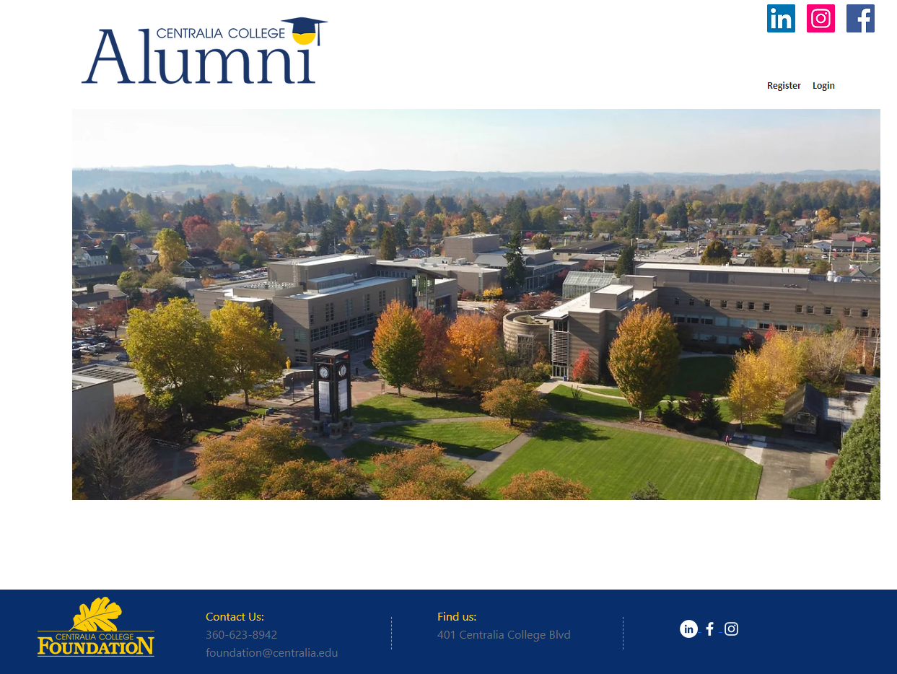
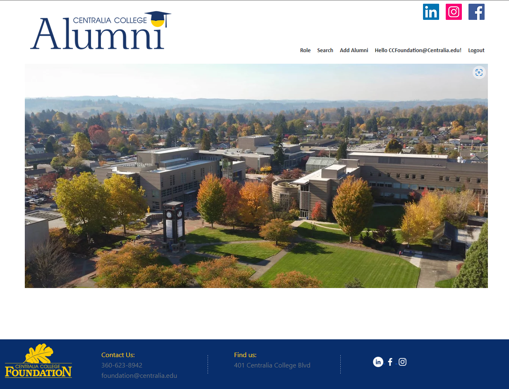

# General Introduction of Alumni Tracker Site

After installing the project, using the Install-Readme. Opening the webpage brings you to the home page:

* On the top right, there are the social media links, and below that Register and login.  
* Clicking Register makes a new Alumni Account, or if you are using the admin account from the Install-Readme, click log in  
* After Logging in as an Alumni, the page will display a hello along with your email, and a logout button.
    * Clicking the Hello button will let you change functions of your account, and download or delete personal data.
* After Logging in as the Super Admin account (from the Install-Readme), the toolbar will have Role, Search, Add Alumni, a Hello CCFoundation@Centralia.edu, and a logout button.  

    * `Role` allows this account to assign or remove roles from other accounts. Roles include Admin, and SuperAdmin.
        * Super Admin can use all functions of the page
        * Admin can not create Roles for themself or others
        * everyone not in these two lists are only allowed the profile page, logout, and the home page.
    * `Search` gives Admins and SuperAdmins a table of Alumnis, with the ability to search against it and SuperAdmins can save it as a CSV file.
    * `Add Alumni` Lets Admins and SuperAdmins Create Alumni Accounts which then need confirmed by the Alumni through email.

